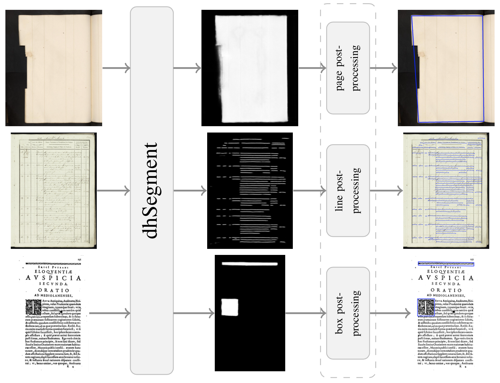
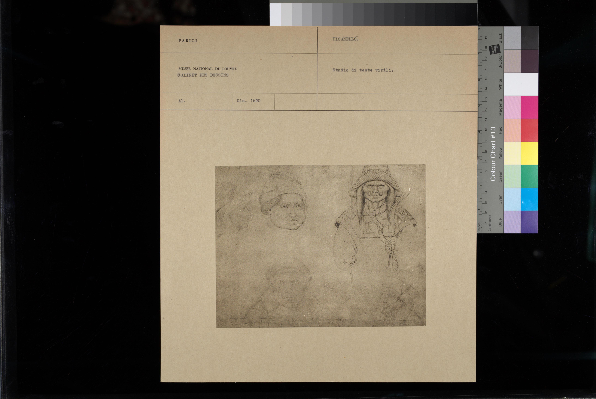
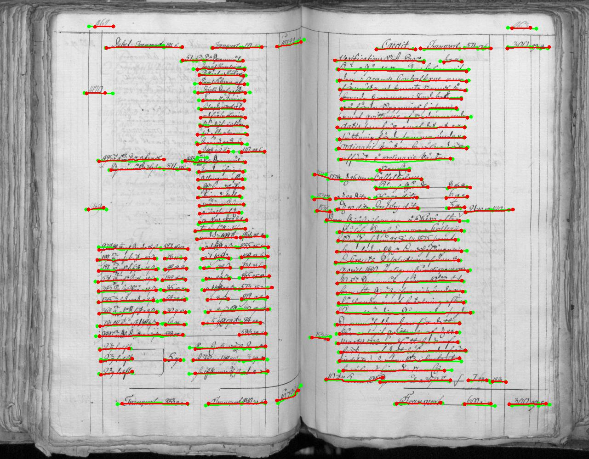
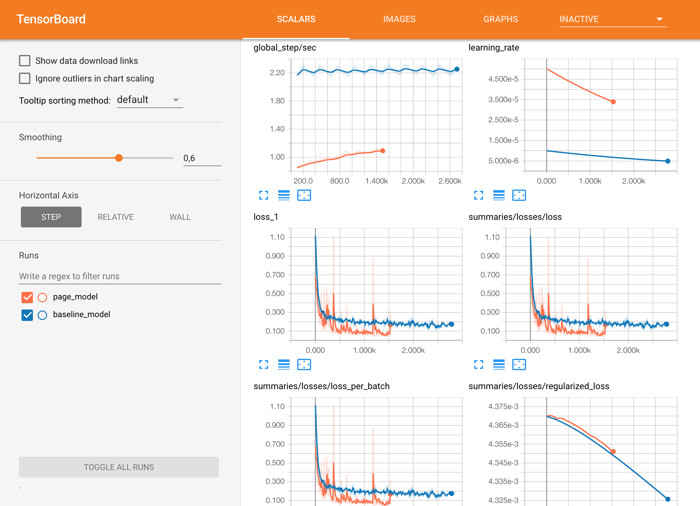

============
Introduction
============

What is dhSegment?
------------------

dhSegment is a generic approach for Historical Document Processing.
It relies on a Convolutional Neural Network to do the heavy lifting of predicting pixelwise characteristics.
Then simple image processing operations are provided to extract the components of interest (boxes, polygons, lines, masks, ...)

A few key facts:

- You only need to provide a list of images with annotated masks, which can easily be created with an image editing software (Gimp, Photoshop). You only need to draw the elements you care about!

- Allows to classify each pixel across multiple classes, with the possibility of assigning multiple labels per pixel.

- On-the-fly data augmentation, and efficient batching of batches.

- Leverages a state-of-the-art pre-trained network (Resnet50) to lower the need for training data and improve generalization.

- Monitor training on Tensorboard very easily.

- A list of simple image processing operations are already implemented such that the post-processing steps only take a couple of lines.

What sort of training data do I need?
---------------------------------------

Each training sample consists in an image of a document and its corresponding parts to be predicted.

.. image:: ../_static/cini_labels.jpg
    :width: 45 %
    :alt: example label

Additionally, a text file encoding the RGB values of the classes needs to be provided.
In this case if we want the classes 'background', 'document' and 'photograph' to be respectively
classes 0, 1, and 2 we need to encode their color line-by-line: ::

    0 255 0
    255 0 0
    0 0 255

.. _usecases-label:

Use cases
---------

Page Segmentation
^^^^^^^^^^^^^^^^^

.. image:: ../_static/page.jpg
    :width: 50 %
    :alt: page extraction use case

Dataset : READ-BAD :cite:`gruning2018read` annotated by :cite:`tensmeyer2017pagenet`.

Layout Analysis
^^^^^^^^^^^^^^^

.. image:: ../_static/diva.jpg
    :width: 45 %
    :alt: diva use case
.. image:: ../_static/diva_preds.png
    :width: 45 %
    :alt: diva predictions use case

Dataset : DIVA-HisDB :cite:`simistira2016diva`.

Ornament Extraction
^^^^^^^^^^^^^^^^^^^

.. image:: ../_static/ornaments.jpg
    :width: 50 %
    :alt: ornaments use case

Dataset : BCU collection.

Line Detection
^^^^^^^^^^^^^^

Dataset : READ-BAD :cite:`gruning2018read`.

Document Segmentation
^^^^^^^^^^^^^^^^^^^^^

.. image:: ../_static/cini.jpg
    :width: 70 %
    :alt: cini photo collection extraction use case

Dataset : Photo-collection from the Cini Foundation.

Tensorboard Integration
-----------------------
The TensorBoard integration allows to visualize your TensorFlow graph, plot metrics
and show the images and predictions during the execution of the graph.

.. image:: ../_static/tensorboard_2.png
    :width: 65 %
    :alt: tensorboard example 2
.. image:: ../_static/tensorboard_3.png
    :width: 65 %
    :alt: tensorboard example 3