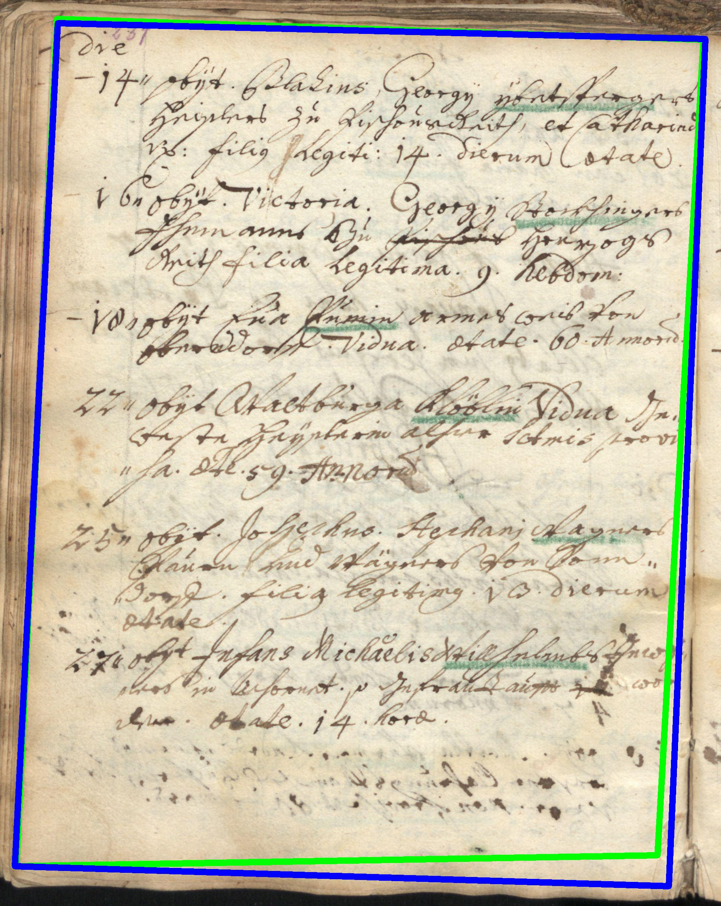
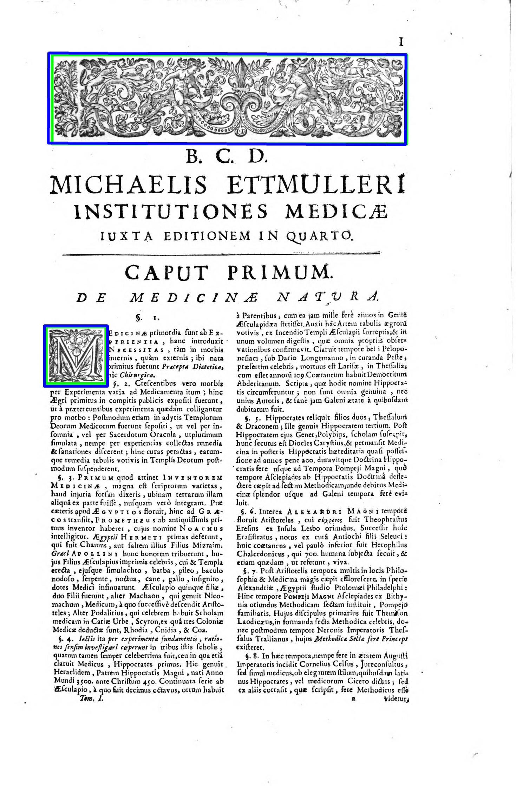
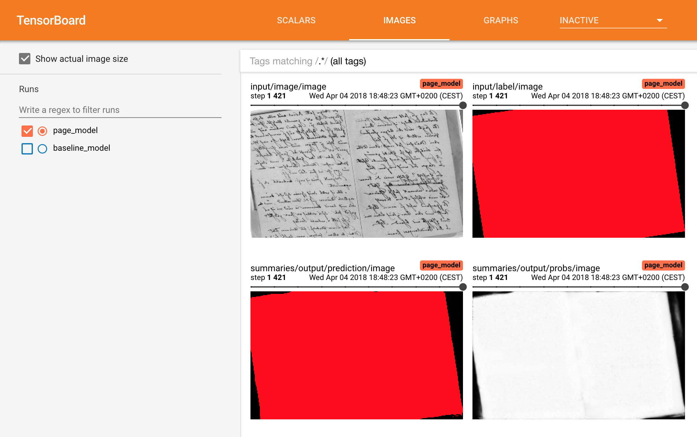
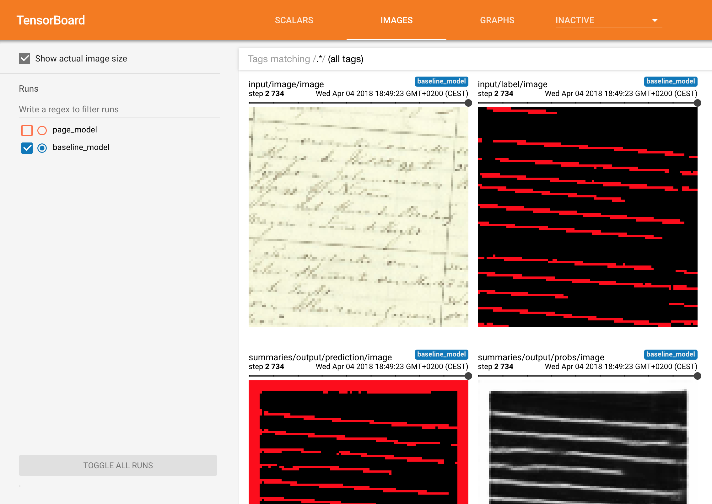

# What is dhSegment?

{: .center-image .w-70}

It is a generic approach for Historical Document Processing. It relies on a Convolutional Neural Network to do the heavy lifting of predicting pixelwise characteristics. Then simple image processing operations are provided to extract the components of interest (boxes, polygons, lines, masks, ...)

It was originally created by [Benoit Seguin](https://twitter.com/Seguin_Be) and Sofia Ares Oliveira at the Digital Humanities Laboratory (DHLAB) at EPFL for the needs of the Venice Time Machine.

A few key facts: 

- You only need to provide a list of images with annotated masks, which can easily be created with an image editing software (Gimp, Photoshop). You only need to draw the elements you care about!

- Allows to classify each pixel across multiple classes, with the possibility of assigning multiple labels per pixel.

- On-the-fly data augmentation, and efficient batching of batches.

- Leverages a state-of-the-art pre-trained network (Resnet50) to lower the need for training data and improve generalization.

- Monitor training on Tensorboard very easily.

- A list of simple image processing operations are already implemented such that the post-processing steps only take a couple of lines.

# What sort of training data do I need?

Each training sample consists in an image of a document and its corresponding parts to be predicted.

<div style="margin:0 auto; width: 80%;">
    <image src="assets/images/cini_input.jpg" style="width: 48%;"></image>
    <image src="assets/images/cini_labels.jpg" style="width: 48%;"></image>
</div>

Additionally, a text file encoding the RGB values of the classes needs to be provided. In this case if we want the classes 'background', 'document' and 'photograph' to be respectively classes 0, 1, and 2 we need to encode their color line-by-line:

```
0 255 0
255 0 0
0 0 255
```


# Use cases

## Page Segmentation

{: .center-image .w-50}

Dataset : READ-BAD [2] annotated by [1].


## Layout Analysis

<div style="margin:0 auto; width: 80%;">
    <image src="assets/images/diva.jpg" style="width: 45%;"></image>
    <image src="assets/images/diva_preds.png" style="width: 45%;"></image>
</div>

Dataset : DIVA-HisDB [3].

## Ornament Extraction

{: .center-image .w-50}

Dataset : BCU collection.

## Line Detection

{: .center-image .w-70}

Dataset : READ-BAD [2].

## Document Segmentation

{: .center-image .w-70}

Dataset : Photo-collection from the Cini Foundation.

# Tensorboard Integration

{: .center-image .w-70}
{: .center-image .w-70}
{: .center-image .w-70}

# References

If you want to cite this work, please cite it as :
```
S. Ares Oliveira, B.Seguin, and F. Kaplan, “dhSegment: A generic deep-learning approach for document segmentation,” in Frontiers in Handwriting Recognition (ICFHR), 2018 16th International Conference on, pp. 7-12, IEEE, 2018.
```
#### Dataset references :
```
[1] C. Tensmeyer, B. Davis, C. Wigington, I. Lee, and B. Barrett, “Pagenet: Page boundary extraction in historical handwritten documents,” in Proceedings of the 4th International Workshop on Historical Document Imaging and Processing, pp. 59–64, ACM, 2017.
[2] T. Grüning, R. Labahn, M. Diem, F. Kleber, and S. Fiel, “Read-bad: A new dataset and evaluation scheme for baseline detection in archival documents,” in 2018 13th IAPR International Workshop on Document Analysis Systems (DAS), pp. 351–356, IEEE, 2018.
[3] F. Simistira, M. Seuret, N. Eichenberger, A. Garz, M. Liwicki, and R. Ingold, “DIVA-HisDB: A precisely annotated large dataset of challenging medieval manuscripts,” in Frontiers in Handwriting Recognition (ICFHR), 2016 15th International Conference on, pp. 471–476, IEEE, 2016.
```
